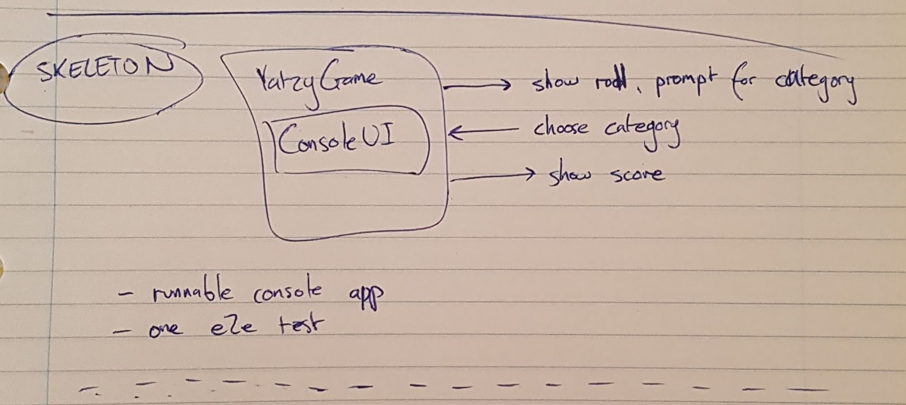
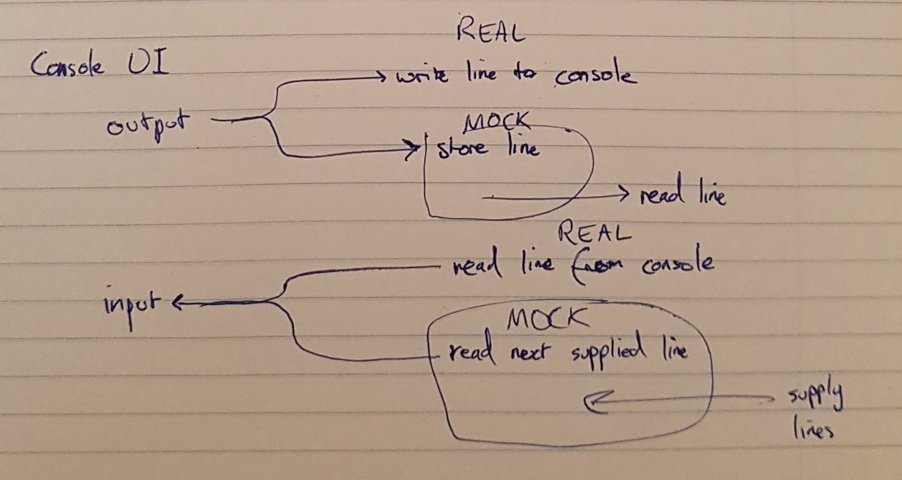

# Yatzy top down TDD development log

sketched an end goal: a playable yatzy console app:

sketched a "walking skeleton" (working? walking?):

- wrote and skeleton e2e test, started implementing required classes
- made tests and game runnable from console

## A non-functional skeleton :(

git tag: `01_skeleton`

At this point, I realised that the game doesn't work from the console.
The end to end test passes, but it isn't really end to end - it doesn't
run the application destined to be deployed to users' machines. To do this,
I think I'd need an over-elaborate way to fake console IO. I can't be
bothered figuring out how I'd do this, so I'll stick to running the
YatzyConsoleApp class. I note at this point that I'm not really doing this.
Most of the e2e test actions don't interact with the game. To make the e2e
test closer to the 'end', I should run the YatzyConsoleApp class via its
main() method.

The "do the simplest thing that will pass the test" strategy seems wrong
when writing the skeleton. I've made the skeleton e2e test pass by doing
the simplest thing - putting all the expected console output directly in
the mock console output. I think this is defeating the purpose of the
skeleton, which is to hook up a minimal working set of _real_ application
classes. So for now I'll add a constraint that the "simplest thing" must be
done with real application classes, not mocks :)

git commit: `a705451`

Well it's been 3h, and I still don't have a working console app! The TDD book
guys express the constant surprise at how long the skeleton step takes, so that
gives me some comfort. They also mention that the example in their book went
through many revisions - they didn't have all the right design insights the first
time through the exercise.

I've been a bit stuck on how to supply console input from the player in the tests,
so I drew how I think it should work, which helped me design the interfaces:

----

## A better skeleton

git commit: `3bcb501`

Now the console app behaves as the e2e test describes, but the whole thing is a bit
ugly. I think it's time for some refactoring to make things clearer.

git tag: `02_better_skeleton`

The e2e test reads reasonably well, and the console app behaves accordingly. There's
a few things that aren't quite right, like, where's the dice? However, this is a
decent skeleton. We can mock input/output, and the app runs as expected. Let's
figure out the next slice next time.

## Next slice: add dice

I added a dice roll to the e2e test. The test failed. All I had to do to get
it to pass was to change the canned output coming from YatzyConsoleApp.
That feels like cheating. Let's add another test to prevent that cheating!

I originally decided to add dice and show the correct score for this slice,
but it quickly became evident that that was too big a slice. I put the score
display in the todo list.

So I've added the ability to set the next dice roll in the game, and the roll
is correctly displayed. I did it in quite a barbaric way, and now it's time to 
refactor.

<5 minutes later>

I just checked the console app, and it fails with a null pointer exception.
So much for an 'end to end' test! I feel like I've broken some kind of rule
here though, since the code I've added to pass the test is _very_ hacky. I didn't
keep enough separation between the test and the application code.

I added DiceRoller. Now the tests are failing the same null pointer exception
as the console app. This is a good sign.

I injected DiceRoller into the game, and now the console app is working again.

I added RandomDiceRoller, which currently returns the same roll every time. I don't
really know how to test this class, as testing for randomness is prone to flakiness.
Thus, we have passing e2e tests, but the game isn't really correct. I figure this
is because we haven't implemented enough features yet, so I'll forgive that for 
now. I am a little worried though.

git tag: `03_add_dice`

OK, we have dice. Nice.

## Next slice: score based on roll

git tag: `04_score_roll`

Well that was easy. Next!

## Next slice: add a category

git tag: `05_mid_score_calc_refactoring`

Adding a category and scoring based on the given category involved some
refactoring: The ScoreCalculator interface was created, and
ScoreCalculatorFactory created to keep the responsibility of creating
calculators separate from the console app class.

todo:
- draw the design before refactoring started

I was thinking at this point: Is top-down less amenable to distributing
work amongst a team? If design is constantly emerging, and pieces of code
are being ripped apart, there's going to be a lot of merge conflicts. There
doesn't look to be anything on this in the TDD book, and a quick google
didn't show any promising results. I guess I'll just have to try it...

## Next slice: show categories and potential scores, then prompt

Got display of available categories working nice and fast, but something's
not feeling right ... I think I need to separate YatzyGame and YatzyConsoleApp.
YatzyConsoleApp is currently running the gameplay, and dealing with sending
& receiving user io. Tune in next time.

OK it's next time.

git commit: `39d720b`

At this point I've got a game, console app, and console interface classes.
The console app is driving the interface and updating the game. Although
this seems to fit an MVC model, it doesn't feel right. I think the game should
be deciding when to execute game operations, and prompt players for actions etc.
The controller (console app) is currently implementing a lot of the game logic
that I'd expect to find in the game.

git commit: `76e49d4`

Now console app just sets up the game class with console io. Makes more sense!
I briefly thought that the e2e test should use the game class instead, but
that would reduce its end-to-end-iness.

I also thought about adding some unit tests for the new classes: YatzyGame,
YatzyConsolePlayerInterface. YatzyGame probably needs them, since it's implementing
the game logic. However, the logic is quite simple at the moment, and is
sufficiently covered by the end to end tests.

# long term todo

- put on github
- handle bad input from user
- randomise RandomDiceRoller!
- make nice readable github page
